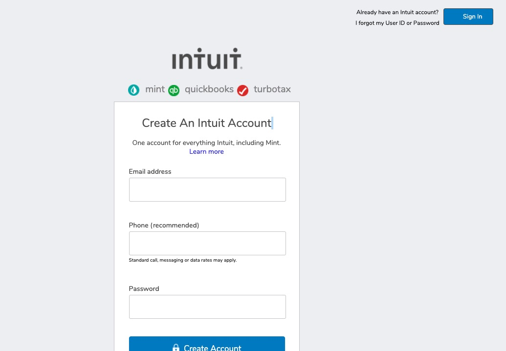

<h1 align="center">HTML Forms</h1>

  
  
  

## Table of Contents
* [About](#About)
* [Built With](#built)
* [Contributing](#Contributing)
* [Show Your Support](#show)
* [Authors](#Authors)

## About

  

This is the second project of the Main HTML/CSS curriculum at [Microverse](https://www.microverse.org/). The goal was to build an HTML document that matches the appearance of mint.com’s signup page using html and css. You can see the detailed project specs [here](https://www.theodinproject.com/courses/html5-and-css3/lessons/html-forms)

## Built With 

This app was built using the following:
- HTML5
- CSS3

## Contributing

Contributions, issues and feature requests are welcome!

## Show Your Support 

Feel free to drop a :+1: to show your support. It'd be greatly appreciated it :pray:

## Authors

:bust_in_silhouette: Kerron King

* Github: [@KerronKing](https://github.com/KerronKing)
* Twitter: [@KerronTriniDev](https://twitter.com/kerrontrinidev)
* Linkedin: [Kerron King](linkedin.com/in/kerron-shawn-king)

:bust_in_silhouette: Julian Belmonte

* Github: [@jucora](https://github.com/jucora)
* Twitter: [@Julian Belmonte](twitter.com/JulianBelmonte)
* Linkedin: [Julian Belmonte](linkedin.com/in/julianbel)